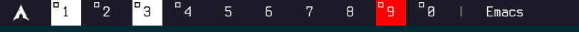

# RiverQL

RiverQL exposes [River window manager](https://isaacfreund.com/software/river/) state over GraphQL.
It ships a server that bridges River's Wayland status protocol into GraphQL queries and
subscriptions, plus a CLI client for driving `graphql-transport-ws` streams.

## Example Status Bar (eww + RiverQL)

`examples/eww` contains a ready-to-run setup that wires RiverQL into an
[eww](https://elkowar.github.io/eww/) status bar. The example launches a snapshot
poller for river outputs, reacts to live tag updates, and renders the result as a
panel.



This indicates that:
- Tags 1 and 3 are focused.
- Tags 1, 2, 3, and 0 are currently occupied.
- No urgent tags are present.

Try it by copying the directory into your own eww config (`~/.config/eww`) or
by running `eww --config ./examples/eww open bar-window-1` inside the repository while the
RiverQL server is running.

This example supports multiple monitors. Open `bar-window-1` for DP-1, `bar-window-2` for DP-2 respectively.
If your environment has a different name e.g. eDP-1, you need to modify the code.

## Features

- GraphQL access to River output/seat state (tags, layouts, focused view, mode)
- Real-time subscriptions via `graphql-transport-ws`
- Lightweight CLI client for ad-hoc GraphQL subscriptions

## Installation

```bash
cargo install riverql
```

This installs a `riverql` binary in your Cargo bin directory.

## Getting Started

Most setups launch the server inside River's init script:

```bash
riverql --server &
```

By default this creates a Unix socket under `$XDG_RUNTIME_DIR/riverql.sock`. To
override, use `--listen`, e.g. `riverql --server --listen tcp://127.0.0.1:8080`.

The server logs via `tracing`; tune with `RUST_LOG` (for instance
`RUST_LOG=riverql=debug`).

### GraphQL Endpoints

- HTTP/WS endpoint: `/graphql`
- GraphiQL UI: `/graphiql`
- Schema SDL: `/schema`

Example query:

```graphql
{
  outputs {
    name
    focusedTags
    viewTags
    urgentTags
    layoutName
  }
  seatFocusedOutput { name }
}
```

Fetch a single output by name when you only care about one:

```graphql
query ($name: String!, $tagList: Boolean = true) {
  output(name: $name, tagList: $tagList) {
    name
    focusedTags
    focusedTagsList
    layoutName
  }
}
```

Subscription example:

```graphql
subscription {
  events {
    __typename
    ... on OutputFocusedTags { name tags }
    ... on SeatFocusedOutput { name }
  }
}
```


## Working with Tag Lists

By default RiverQL exposes tag bitmasks as river does. Some environments — notably [eww](https://elkowar.github.io/eww/) —
struggle with bit operations, so any query or subscription can opt into decoded
lists by passing `tagList: true`.
When enabled, `focusedTagsList` / `urgentTagsList` fields become non-null while
the original mask fields remain available for backward compatibility.

```graphql
query ($tagList: Boolean = true) {
  outputs(tagList: $tagList) {
    name
    focusedTags
    focusedTagsList
    urgentTags
    urgentTagsList
  }
}
```

```graphql
subscription ($name: String!, $tagList: Boolean = true) {
  eventsForOutput(outputName: $name, tagList: $tagList) {
    __typename
    ... on OutputFocusedTags { name tags tagsList }
  }
}
```

### Client Mode

When a widget or script (for example an eww widget) needs data, invoke `riverql`
without `--server`:

```bash
riverql 'subscription { events { __typename } }'
```

Key points:

- Inline queries or `@file.graphql`
- Reads stdin when no query argument is supplied
- Uses the default endpoint derived from `--listen`; override with
  `--endpoint` if needed (supports both `unix://path#/graphql` and
  `ws://host:port/path` formats)

### Using with [eww](https://elkowar.github.io/eww/)

Add the server to your River init script (`riverql --server &`). Then, inside
`eww.yuck`, you can consume RiverQL in two ways:

Polling a query:

```clojure
(defpoll river_outputs :interval "5s"
  "riverql 'query { outputs { name focusedTags } }' | jq --unbuffered -c '.data.outputs'")

(defwidget river-tags []
  (box :orientation "vertical"
    (for output in river_outputs
      (box :class "tag-row"
        (label :text (format "%s" (. output 'name)))
        (label :text (format "%s" (. output 'focusedTags)))))))
```

Listening for live events:

```clojure
(deflisten events :initial "{}"
  "riverql 'subscription { events { __typename ... on OutputFocusedTags { name tags } } }' | jq --unbuffered  -c '.data.events'")

(defwidget river-event-feed []
  (box :orientation "vertical"
    (label :text (format "Latest event: %s" events))))
```

`defpoll` is ideal for periodic snapshots (e.g. populating a list of outputs),
while `deflisten` reacts instantly to subscription pushes. Both examples assume
`riverql` is on `PATH` and that `jq` is available to compact JSON.

## License

Code in this repository is licensed under MIT; see [LICENSE](LICENSE).

The XML files under `protocol/` are copied from upstream River (GPL-3.0-or-later)
and wlroots (MIT). They retain their original licensing. Consult the upstream
projects for full details.
